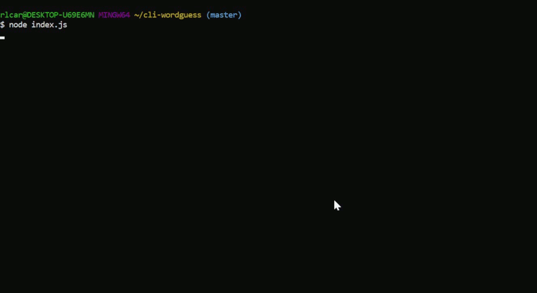

### CLI Wordguess

## Overview

This is a command line based word guess game that uses Node and the Inquirer module.

## Instructions
* Modify the `wordlist.txt` file to have all of the desired words on their own line (with no additional lines at the end)

* Start the application with the command `node index`

* A random word/phrase is selected from the list and placeholder characters are displayed in the console for all alpha characters. Non-letter characters such as spaces are revealed automatically

